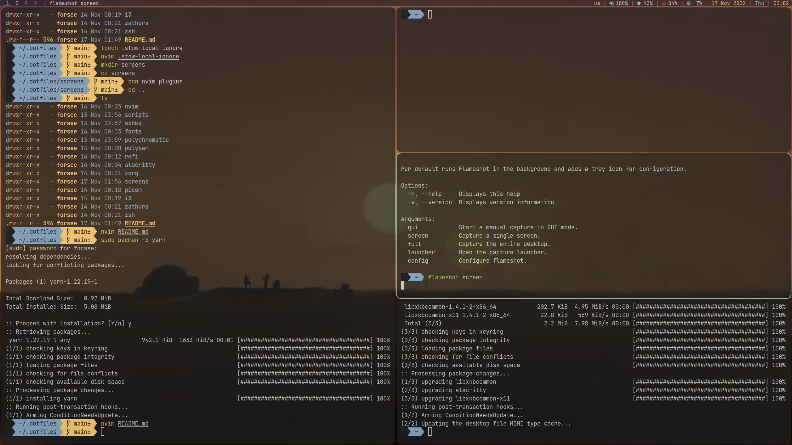

# My dotfiles

## Workspace

Use GNU stow to make the symlinks

Used soft:

- i3 gaps
- rofi
- polybar
- translate shell
- nvim (0.8+)
- zathura
- sxhkd
- picom
- alacritty
- zsh (it uses oh-my-zsh just for the prompt, you can remove it)
- python
- node

Don't move remaining keybindings from i3 config to the sxhkdrc, it will break i3 
Don't move ssh-agent startup to .zprofile cause reasons

Nvim config is based off of [chris@machine](https://github.com/LunarVim/Neovim-from-scratch) dotfiles
Rofi translation is a tweaked version of [garyparrot's script](https://github.com/garyparrot/rofi-translate)

